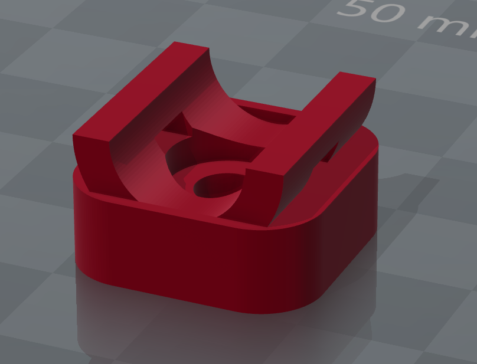

# Cable Mount with Ziptie for 2020 Extrusion Profiles

## What is this?

A mount that attaches to 2020 extrusion profiles through which you can run your cables and secure them with a ziptie.

## Why did I create this?

I initially intended to use the [2020 Cable Zip Tie Mount by joochung](http://www.thingiverse.com/thing:2308406) for my Anet A8 AM8 conversion, but the original design required M5x8 screws which I didn't have (the AM8 uses M5x10 button head screws). The M5x10 proved to long to properly secure the mount, so I redid the original but raised its height by 2mm (5 instead of 7), which gave me the neccessary clearance.

I left the other specifications as they were, so the mount still uses an M5 screw and the hole for the ziptie measures 5x2mm.

I also created to additional version with some fins both vertically and horizontally to slot into the extrusion profile and assure proper alignment. The versions with the fins are harder to print and will require support. I know, it's a bit ugly, but I saw no other way.

## Acknowledgements

This mount design was inspired by the  [2020 Cable Zip Tie Mount](http://www.thingiverse.com/thing:2308406) by [joochung](http://www.thingiverse.com/joochung/about).

## License

This work is licensed under a [Creative Commons Attribution-ShareAlike 4.0 International License](http://creativecommons.org/licenses/by-sa/4.0/).

