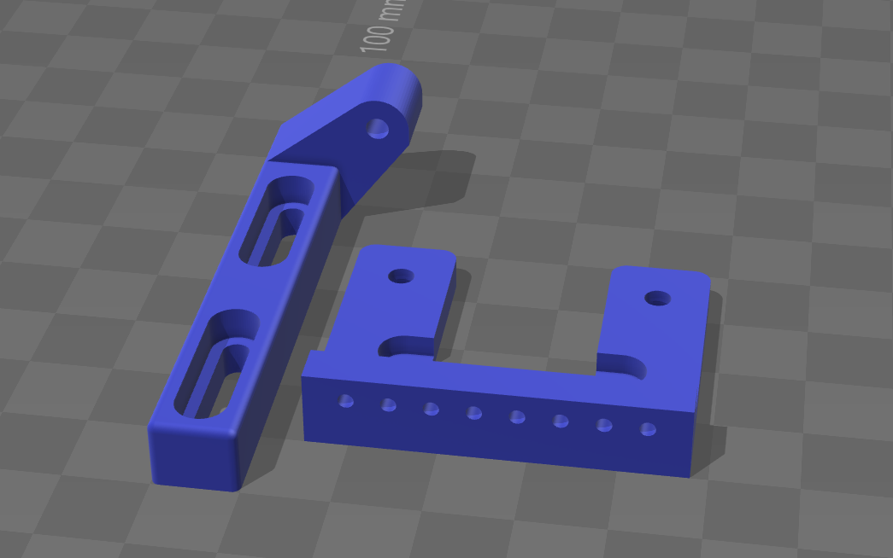

# Low Clearance Z-Endstop Mount for Anet A8

## What is this?

An alternative mount for the z-axis endstop an the Anet A8 that allows the z-axis to be lowered further down than with the stock endstop.

## Why did I create this?

I changed the extruder of my Anet A8 to this [E3D v6 direct extruder](http://www.thingiverse.com/thing:1383913). I used the x-carriage from the [Prusa P3 Steel Toolson Edition](http://www.thingiverse.com/thing:1036871). As a result, I have gained additional build height as the new extruder doesn't protrude as much below the x-axis rods as the stock one.

The stock endstop would trigger far to high with the nozzle still being more than 10mm away from the build plate. So I designed this new endstop mount, that puts the trigger point below the z-axis couplers and gives me the needed clearance. It comes with a fine adjust mount that screws onto the x-axis motor mount.

## How do I mount it?

1. Unscrew the two left screws of the left z-axis motor mount.
2. Slide the endstop mount onto the motor plate and put the screws back in.
3. Mount the endstop switch to the side of the endstop mount using the self.-tapping screws provided with the Anet A8.
4. Take a long M3 screw, screw it through the adjustment leg and secure it with a least two nuts.
5. Unscrew the two right screw of the x-axis motor.
6. Position the adjustment leg over the hole for the motor screws and screw it down.
7. Adjust the endstop position using the long M3 screw as needed.

## Acknowledgements

This endstop design was inspired by the [Z Endstop Fine Adjustment Prusa i3 - Anet A8](http://www.thingiverse.com/thing:1776429) by [Meermeneer](http://www.thingiverse.com/Meermeneer/about). I initially used  his endstop mount, but it was also too high.

## License

This work is licensed under a [Creative Commons Attribution-ShareAlike 4.0 International License](http://creativecommons.org/licenses/by-sa/4.0/).

