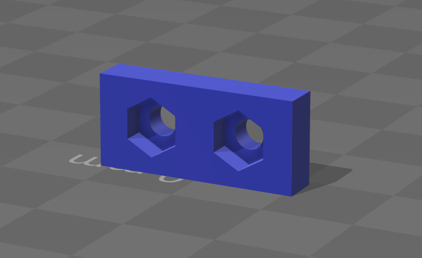

# Power Supply Mounting Helper Bracket for Anet A8

## What is this?

A small bracket that goes inside the power supply of an Anet A8. It adds a mounting point so that a power supply cover can be fastened to both sides of the power supply.

## Why did I create this?

I downloaded [a cover for the power supply of my Anet A8 from Thingiverse](http://www.thingiverse.com/thing:1913005) but had trouble mounting it properly. My version of the power supply was missing a screw hole on one side of the power supply and the cover was quite wobbly when screwed down on only one side.

I created this small part which has to be attached to the meshed cover of the supply from the inside. The bracket holds two nuts, one of which is used to attache the bracket to the power supply, the other one then becomes a mount point for the cover.

## DISCLAIMER

To mount this part you have to open your power supply as the bracket has to be mounted from the inside. 

IF YOU DO NOT FEEL COMFORTABLE WITH WHAT YOU ARE DOING AT ANY POINT, DO NOT PROCEED ANY FURTHER.

DO NOT OPEN YOUR POWER SUPPLY WHILE IT IS STILL CONNECTED TO THE MAINS!

BEWARE OF THE RESIDUAL CHARGE THAT MAY STILL EXISTS IN THE LARGE CAPACITORS. DO NOT TOUCH THEM.

USING AND MOUNTING THIS PART HAPPENS AT YOUR OWN RISK!

## License

This work is licensed under a [Creative Commons Attribution-ShareAlike 4.0 International License](http://creativecommons.org/licenses/by-sa/4.0/).

