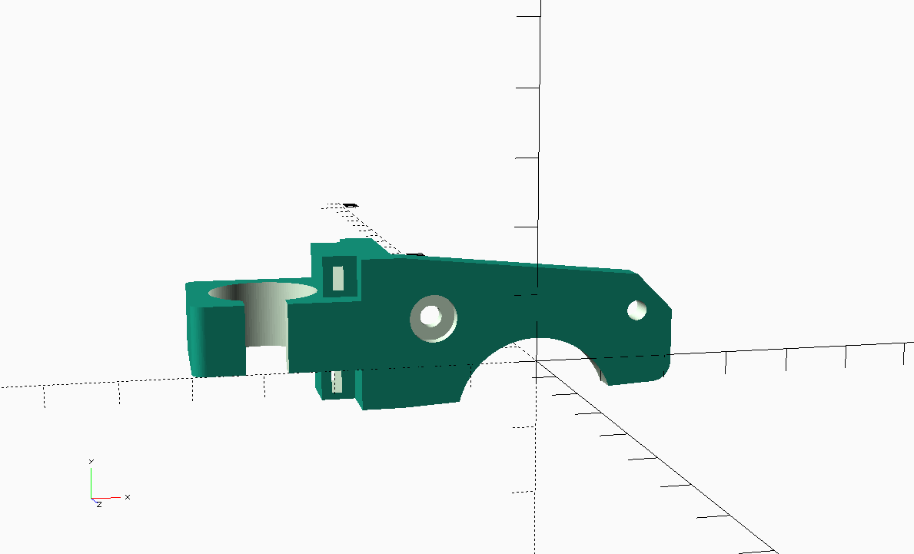
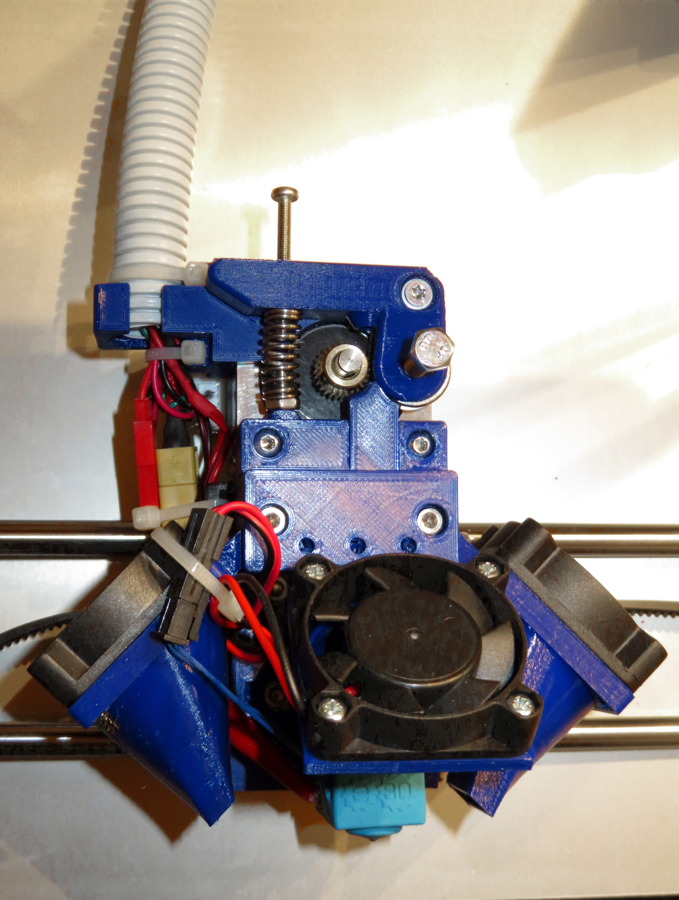

# Cable Tube Extruder Mount

## What is this?

A modified mounting plate for a direct drive extruder that accepts a 16mm
cable tube (aka corrugated pipe) to run the cables through.

## Why did I create this?

I recently upgraded my Anet A8 extruder & hotend to an E3Dv6 hotend with a direct driver Extruder
using the [Customizable direct drive extruder for E3D v6 hotend for Prusa i3 / Wilson / Geeetech](http://www.thingiverse.com/thing:1383913) from Thingiverse.

I also added the part cooling fan ducts from [a remixed version of the above thing](http://www.thingiverse.com/thing:1514245), ending up with wires for the
heating element, the thermistor, the extruder motor and two sets of fans.

To add some stiffness to the wiring running from the extruder to the frame, I
decided against the typical spiral cable wrap and opted for a 16mm cable tube,
also known as corrugated pipe. It has an outer diameter of 16mm and is "self supporting",
so that the wire harness never hangs down.

This tube behaves best, when it is firmly attached to something at both ends. I
modified the original SCAD file, removed all parts other than the top plate and
added a tube and zip-tie mount to it.

## How do I mount it

It screws onto the extruder motor just as the original top plate would.

## Acknowledgements

- [gtcdma](http://www.thingiverse.com/gtcdma/about) for the original customizable extruder
