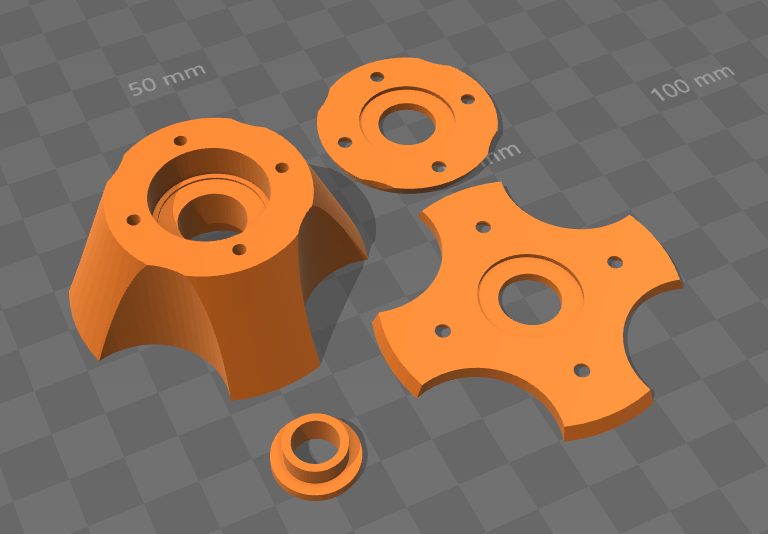

# Customizable Spool Holder

## What is this?

A spool holder cone that is used in pairs to hold a filament spool on a holder with a center rod.

## Why did I create this?

One of my printers came with an acrylic filament holder that uses an 8mm rod to hold the spool. To ensure a smooth unspooling of the filament and a centered mount of the spool itself, I designed these spool holder cones. I tried several variations of spool cones from Thingiverse but none of these fulfilled my expectations. So I made my own.

### Features

- uses two 608ZZ bearings per cone and these bearings are the only part of the cone that comes in contact with the threaded rod
- the washers clamp only the outer ring of the bearings to the cone, allowing them to spin freely
- the small sleeve clamps down on the inner ring of the bearing so that a nut on the threaded bolt can hold the cone in place while it still can rotate freely.

## How do I assemble it?

### You will need

- 4x 608ZZ bearings
- 8 3x12mm self-tapping countersunk screws
- 2 pieces of each printed part
- a screwdriver for the self-tapping screws

### Assembly

You will need two pieces of each part for a complete spool holder. You will also need 4 608ZZ bearings.

1. Insert the bearings into the recess on both sides of the cone (largest part).
2. Screw the corresponding washer to each side of the cone.
3. Slide the sleeve onto the threaded rod.
4. Slide the cone onto the threaded rod. The side of the sleeve with the smaller diameter must face the outside of the cone.
5. Put a spool on the threaded rod
6. Repeat steps 4 and 3 for the other side.
7. Tighten down the cones using nuts on the threaded rod.

## License

This work is licensed under a [Creative Commons Attribution-ShareAlike 4.0 International License](http://creativecommons.org/licenses/by-sa/4.0/).

