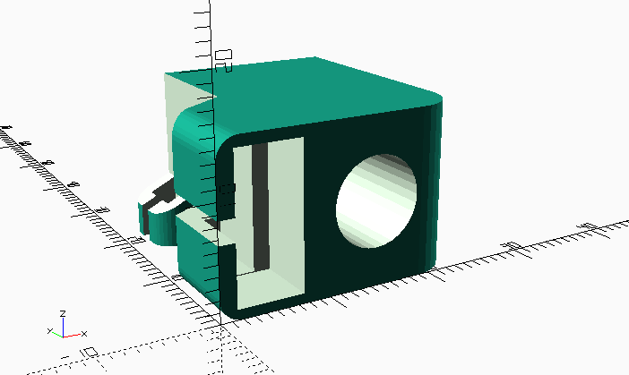

# Customizable X-Axis Endstop Mount

## What is this?

An OpenSCAD version of the x-axis endstop mount for the [Smooth X-axis for Prusa i3 with Leadscrews](http://www.thingiverse.com/thing:1103976) by MazaaFIN with customizable length.

## Why did I create this?

I own an Anet A8 printer and upgraded all the x-axis parts to the ones supplied by MazaaFIN in his [Smooth X-axis for Prusa i3 with Leadscrews](http://www.thingiverse.com/thing:1103976) thing. With one exception: I use a different extruder
carriage and ran into the problem that due to other parts mounted on the extruder, the carriage couldn't reach the
endstop anymore before slamming into my leadscrew. The original endstop with its 19mm length is just a few millimeters
too short, so I recreated the endstop in OpenSCAD and made its length customizable.

## How do I print my own, customized version?

The provided STL file has a 24mm length (which is what I needed), but you can easily create your own custom version 
of it by modifiying the `endstopLength` variable at the top of the OpenSCAD file, render it and then export it to
STL. Just don't set the length to a value lower than 17mm, otherwise crazy things will happen.

I added two small support structures directly in the file to make things easier. You will need to cut that away later
or you can disable support generation in the SCAD file by setting `generateSupports = false`. You will then need
to generate your own supports in your slicer.

## License

As the original work is licensed under a Creative Common Attribution Non-Commercial 3.0 license, I have
to license this file under the same license.

## Acknowledgements

- [MazaaFIN](http://www.thingiverse.com/MazaaFIN/about) for the original endstop